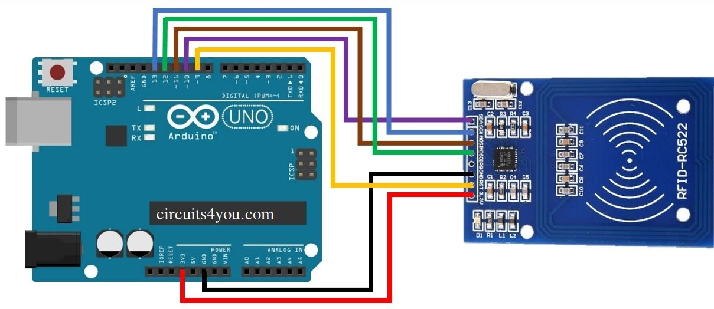
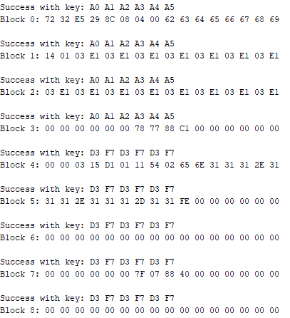

# RFID bruteforce keys

Performs a brute force at MIFARE Classic card keys, whith arduino RC522 reader.

## Requirements

This example uses the [MFRC522](https://github.com/miguelbalboa/rfid) Arduino library.

## Circuit connections

## Example of a successful brute force

